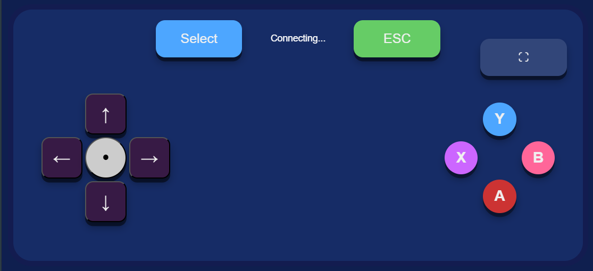

# Module 7.2 - Remote controller

## 📁 Project Structure

```
remote-controller/
├── documenten/
│   ├── 7.2 plan van aanpak...
│   ├── Functioneel en techn...
    └── reflectie-doc.1.pdf...
├── node_modules/
├── public/
│   ├── index.html
│   ├── server-1.js
│   └── style.css
├── .gitattributes
├── .gitignore
├── README.md
├── Video Project 2.mp4
├── package-lock.json
├── package.json
├── remote-controller.png
└──trello-planning
```

## Over dit project

Deze remote controller is een mobiele game controller waarmee je via je telefoon een browserspel op je computer kunt besturen. De telefoon en computer communiceren realtime met elkaar via WebSockets. Als demo gebruik ik **Kirby Nightmare in Dreamland**, een spel dat in de browser speelbaar is.

De controller open je via de browser op je telefoon. Hij heeft een D-pad voor beweging, Select/ESC knoppen, en actieknoppen (A, B, X, Y) — vergelijkbaar met een echte gamepad.

## Gebruikte technieken

- **Node.js** – server die de verbinding tussen telefoon en computer regelt
- **WebSockets** – voor realtime communicatie tussen telefoon en computer
- **@nut-tree-fork/nut-js** – om de ontvangen input om te zetten in daadwerkelijke toetsaanslagen op de computer
- **HTML/CSS/JavaScript** – voor de mobiele controller interface

## Screenshot



## Hoe gebruik je het

1. Clone deze repository
2. Installeer de dependencies:
```bash
   npm install
```
3. Start de server:
```bash
   node server.js
```
4. Open op je computer het browserspel (bijv. Kirby Nightmare in Dreamland)
5. Open op je telefoon de URL die de server aangeeft (zelfde wifi-netwerk als je computer)
6. Gebruik de D-pad en knoppen op je telefoon om het spel op je computer te besturen